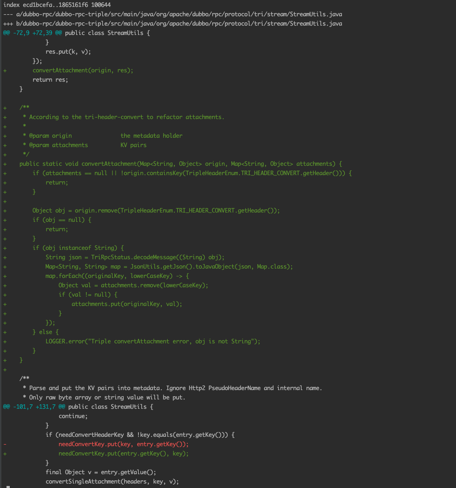

# Dubbo Demo

---------------------------------

## [Issue 11208](https://github.com/apache/dubbo/issues/11208)

### 前言
- 基于3.1.4版本使用triple协议、ZK注册中心
- provider 即 hello-service模块
- consumer 即 hello-admin模块

### 问题描述
具体描述查看[Issue 11208](https://github.com/apache/dubbo/issues/11208)即可

### 修复逻辑
> 在`3.1.4'版本的基础上进行如下两处修复，在本地重新发布一个SNAPSHOT版本进行测试，符合预期。

1. `StreamUtils`的`toAttachments`方法实现缺少`key`值转化【见下图`convertAttachment`方法】
2. `3.1.4`版本的[commit](https://github.com/apache/dubbo/commit/5fdc88d09e2fb7a6e795822ac9f9ebc4b8669c23)`bug` 【见下图最后一行变更代码】

---------------------------------

## [Issue 9295](https://github.com/apache/dubbo/issues/9295) 

### 前言
- 基于3.0版本使用dubbo协议、ZK注册中心
- provider 即 hello-service模块
- consumer 即 hello-admin模块

### 问题描述
provider端register-mode默认为all，服务启动后consumer
端如果没有设置migration为FORCE_APPLICATION，则可以正常访问；
如果设置为FORCE_APPLICATION则将无法访问。

- 观察provider端日志可以看到有一行warn日志：
> 2021-11-19 12:19:10 WARN [org.apache.dubbo.registry.client.metadata.ServiceInstanceMetadataUtils]  [DUBBO] Refreshing of service instance started, but instance hasn't been registered yet., dubbo version: 3.0.0, current host: 172.16.128.132

### 问题更新
社区同学回答
> 对于 triple 协议，server 的启动方式和 dubbo 的不一样，triple 协议中线程切换会更多一些， 在3.x 早期，对 triple 的测试用例覆盖不全。可能就是有一些问题。在新版本3.0.3+ 对于 triple 协议的 it 基本已经覆盖。基本不会再出现这些问题。
在3.0.3引入多实例后，整体有了很大的变化，所以你描述的在哪里修复的可能不太好去定位。
但是基本上是由于部分使用了 context(threadlocal)进行传递的，在发生线程切换时会导致信息丢失，相关的 bug 的应该已经修复。

最终解决方案
> 对项目中使用的dubbo版本升级至3.0.4

[对应issue链接](https://github.com/apache/dubbo/issues/9295)

